# Relação

Apresenta a relação de forma simples entre as telas do protótipo, os requisitos funcionais, as histórias de usuário (HUs) e os épicos do projeto LeituraQuest.

## Acesso e cadastro

### Tela de login

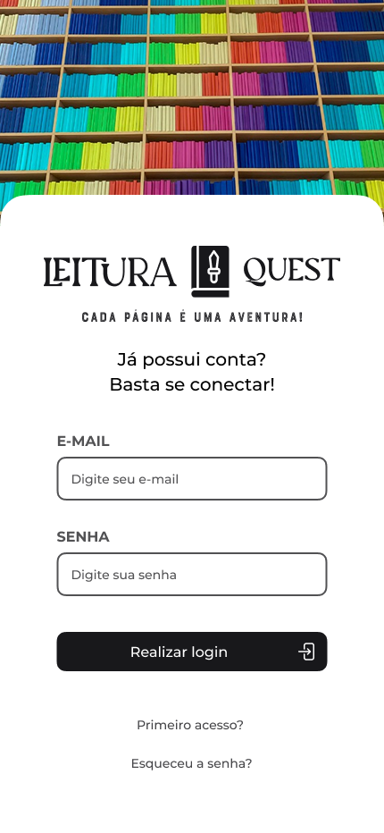

Permite o acesso do usuário por e-mail e senha, além de oferecer caminhos para cadastro e recuperação de senha.

**Relações:** RF002; HU02 — Login no Sistema; EP001 — Autenticação e Acesso ao Sistema.

### Primeira etapa do cadastro

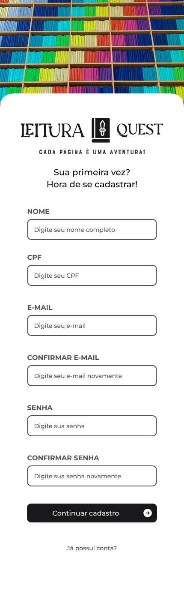

Apresenta o formulário inicial para criação da conta, com dados pessoais, e-mail e senha.

**Relações:** RF001; HU01 — Cadastro de Usuário; EP001 — Autenticação e Acesso ao Sistema.

### Segunda etapa do cadastro

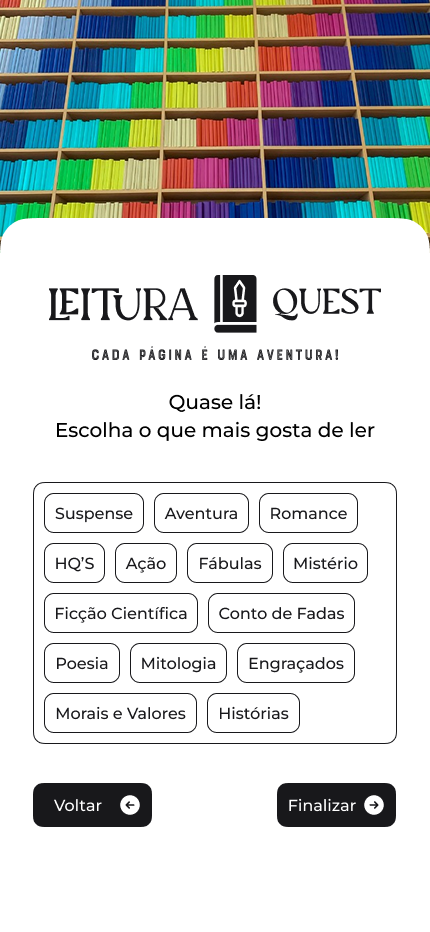

Permite selecionar os gêneros literários de interesse do usuário. Essas preferências podem servir de base para recomendações personalizadas.

**Relações:** RF017; HU01 — Cadastro de Usuário; HU08 — Recomendação de Livros; EP001 e EP003.

### Solicitação de recuperação de senha

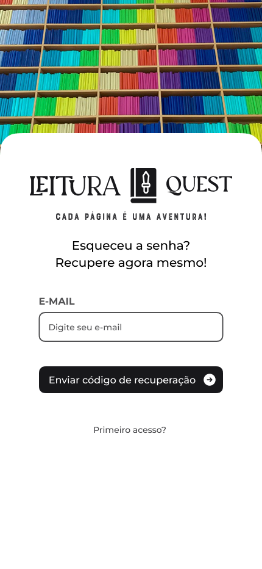

Solicita o e-mail cadastrado para o envio do código de recuperação.

**Relações:** HU03 — Recuperação de Senha; EP001 — Autenticação e Acesso ao Sistema.

### Redefinição de senha

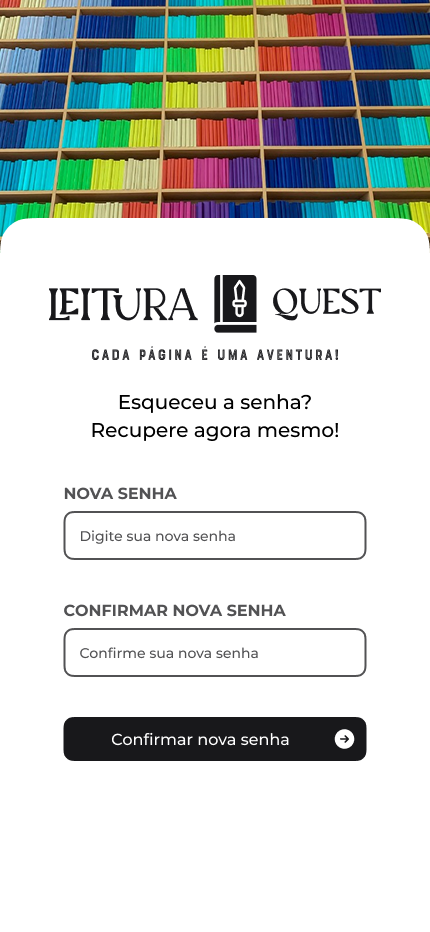

Permite informar e confirmar uma nova senha para recuperar o acesso à conta.

**Relações:** HU03 — Recuperação de Senha; EP001 — Autenticação e Acesso ao Sistema.

## Biblioteca e leitura

### Página inicial

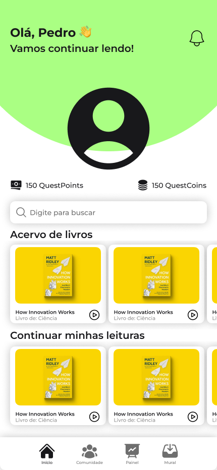

Reúne o acervo de livros, a busca, a continuação das leituras e os saldos de pontos e moedas do aluno.

**Relações:** RF004, RF006, RF007, RF015 e RF016; HU06 — Consulta de Livros; HU07 — Registro de Leitura; HU09 — Sistema de Pontuação; EP003 e EP004.

### Detalhes do livro

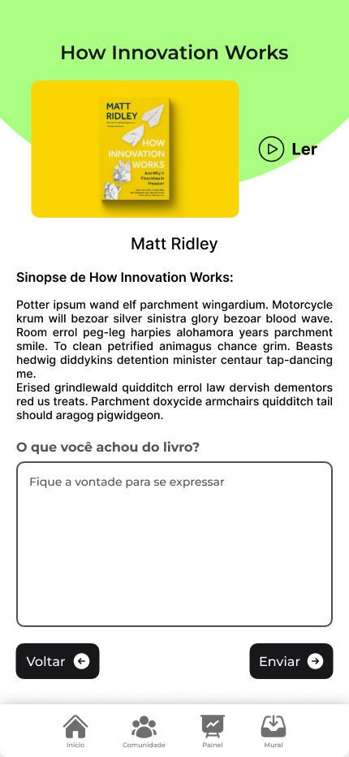

Exibe título, capa, autoria e sinopse, além de permitir iniciar a leitura e registrar uma opinião sobre a obra.

**Relações:** RF005 e RF006; HU06 — Consulta de Livros; HU07 — Registro de Leitura; EP003 — Biblioteca Digital e Leitura.

## Perfil e gamificação

### Loja de personalização

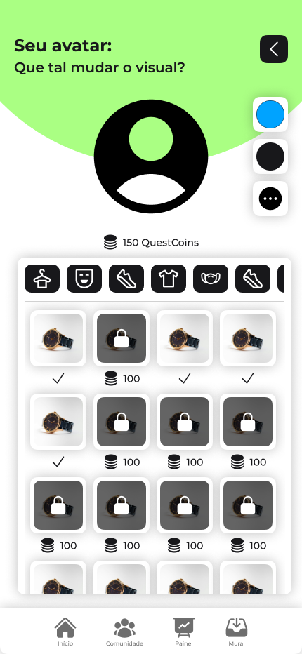

Permite visualizar opções de customização do avatar e desbloquear itens utilizando as moedas obtidas na plataforma.

**Relações:** RF003 e RF007; HU04 — Personalização de Avatar; HU09 — Sistema de Pontuação; EP002 e EP004.

### Detalhes do produto

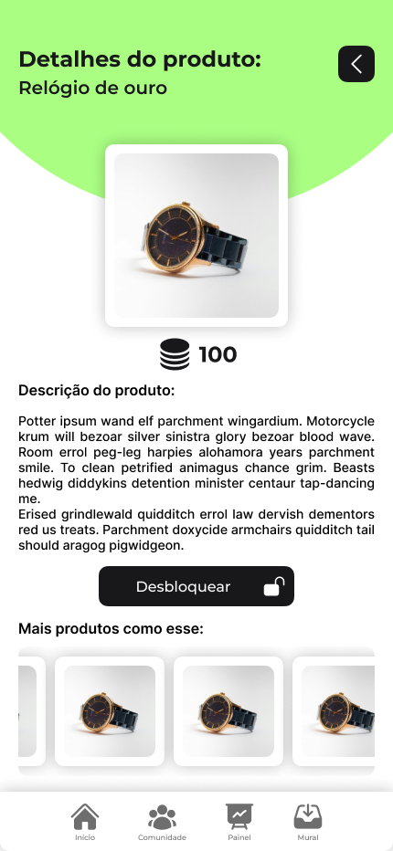

Apresenta a imagem, o custo e a descrição de um item, permitindo seu desbloqueio e a consulta de produtos semelhantes.

**Relações:** RF003 e RF007; HU04 — Personalização de Avatar; HU09 — Sistema de Pontuação; EP002 e EP004.

### Ranking

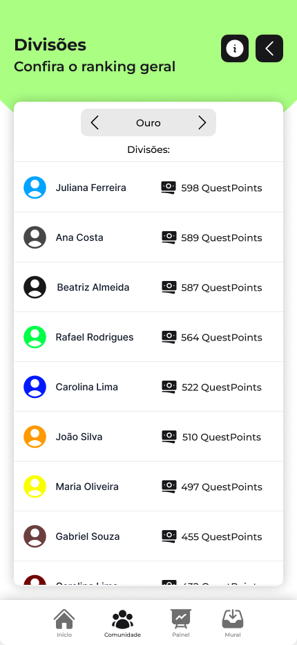

Exibe a classificação dos alunos por divisão e a quantidade de pontos de cada participante.

**Relações:** RF007 e RF008; HU09 — Sistema de Pontuação; HU10 — Rankings; EP004 — Gamificação e Rankings.

## Comunidades

### Comunidade do aluno

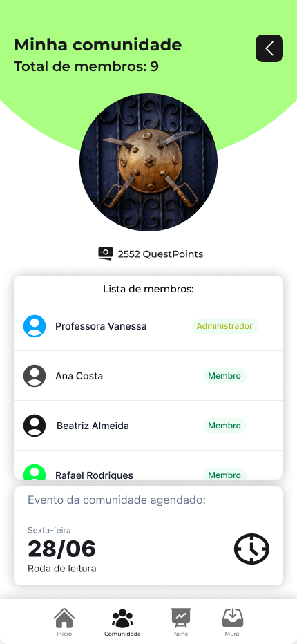

Exibe os membros, o administrador, a pontuação e o próximo evento da comunidade do aluno.

**Relações:** RF009 e RF010; HU11 — Participação em Comunidades; HU15 — Criação de Eventos; EP005 e EP007.

### Outra comunidade

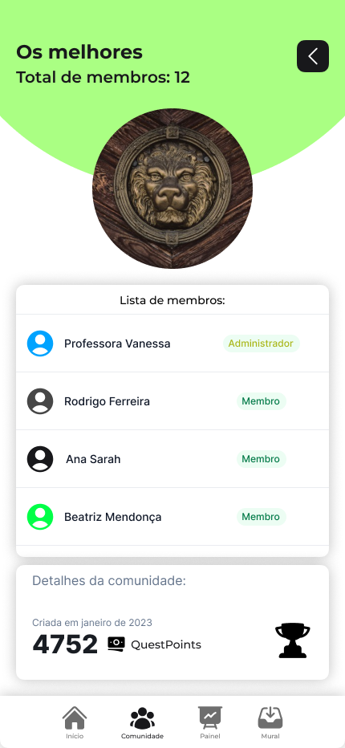

Permite consultar os participantes, a pontuação e as informações gerais de outra comunidade.

**Relações:** RF008 e RF009; HU10 — Rankings; HU11 — Participação em Comunidades; EP004 e EP005.

## Acompanhamento e comunicação

### Painel de desempenho

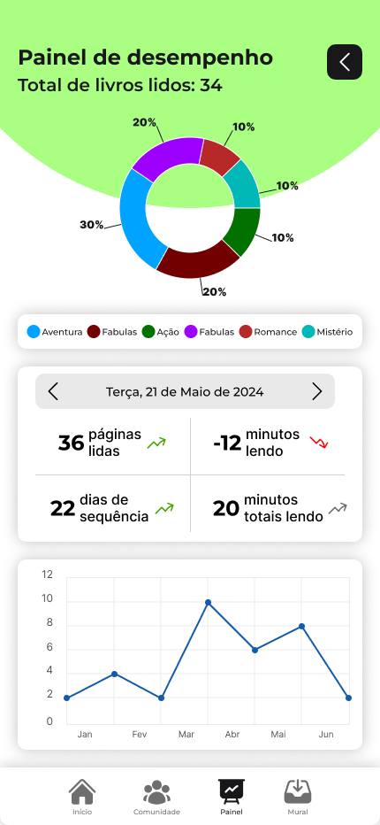

Apresenta métricas de leitura, distribuição por gênero, sequência de dias e evolução do desempenho ao longo do tempo.

**Relações:** RF006, RF012, RF013 e RF018; HU05 — Visualização de Perfil; HU07 — Registro de Leitura; HU13 — Acompanhamento de Desempenho; EP002, EP003 e EP006.

### Mural de avisos

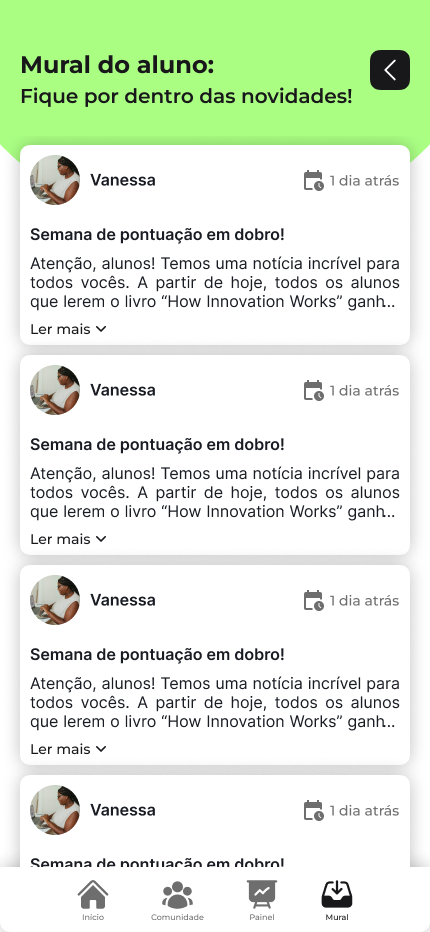

Exibe comunicados publicados para os alunos, incluindo autoria, data, título e conteúdo resumido.

**Relações:** RF014; HU16 — Envio de Avisos; EP007 — Eventos e Avisos.
